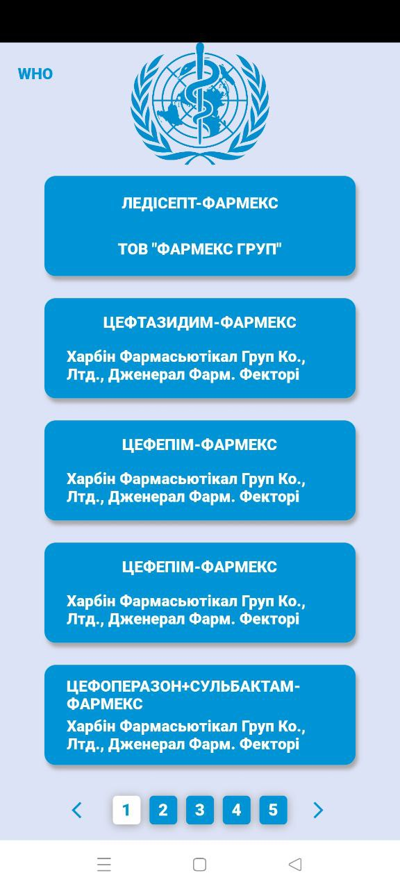
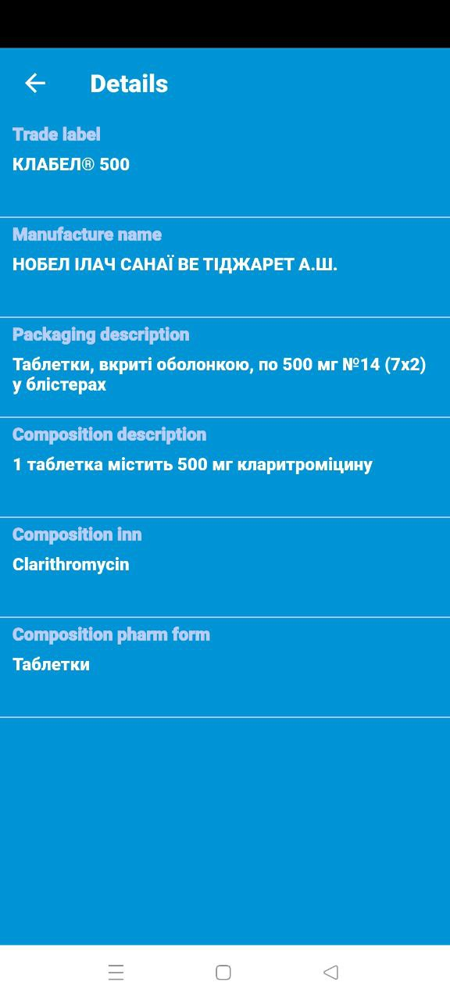
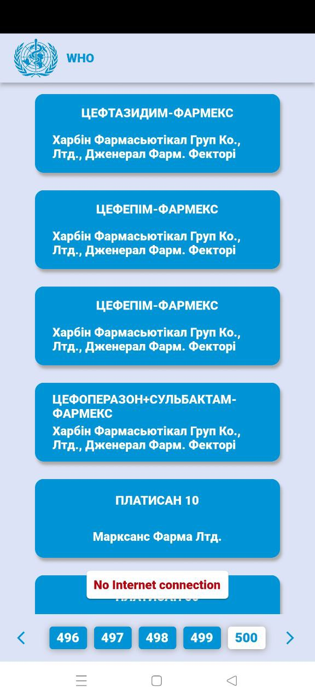

## Flutter - WHO medical app. Test Task for a Flutter Developer position at Software development hub.

<p float="center">
  
   
  
</p>

### Run Locally

Clone the project

```bash
  git clone https://github.com/
```

Install dependencies

```bash
  flutter pub get
```

Run App

```bash
  flutter run
```

### Architecture
The WHO follows a fusion of Clean architecture and DDD design patterns.

### Project Structure 
``` shell
lib/
┣ common/
┃ ┣ app_colors.dart
┃ ┣ app_icons.dart
┃ ┣ base_url.dart
┃ ┣ const_size.dart
┃ ┗ const_texts.dart
┣ core/
┃ ┣ error/
┃ ┃ ┣ exception.dart
┃ ┃ ┗ failure.dart
┃ ┣ platform/
┃ ┃ ┗ network_info.dart
┃ ┗ usecases/
┃   ┗ usecase.dart
┣ feature/
┃ ┣ data/
┃ ┃ ┣ datasources/
┃ ┃ ┃ ┣ locale/
┃ ┃ ┃ ┃ ┣ drugs_list_local_data_source.dart
┃ ┃ ┃ ┃ ┗ drug_detail_local_data_source.dart
┃ ┃ ┃ ┗ remote/
┃ ┃ ┃   ┣ drugs_list_remote_data_source.dart
┃ ┃ ┃   ┗ drug_details_remote_data_source.dart
┃ ┃ ┣ models/
┃ ┃ ┃ ┣ drugs_list_model.dart
┃ ┃ ┃ ┗ drug_details_model.dart
┃ ┃ ┗ repositories/
┃ ┃   ┣ drugs_list_repository_impl.dart
┃ ┃   ┗ drug_details_repository_impl.dart
┃ ┣ domain/
┃ ┃ ┣ entities/
┃ ┃ ┃ ┣ drugs_list_entity.dart
┃ ┃ ┃ ┗ drug_details_entity.dart
┃ ┃ ┣ repositories/
┃ ┃ ┃ ┣ drugs_list_repository.dart
┃ ┃ ┃ ┗ drug_details_repository.dart
┃ ┃ ┗ uscases/
┃ ┃   ┣ get_drugs_list.dart
┃ ┃   ┗ get_drug_details.dart
┃ ┗ presentation/
┃   ┣ bloc/
┃ ┃ ┃ ┣ connection_checker_cubit/
┃ ┃ ┃ ┃ ┣ connection_checker_cubit.dart
┃ ┃ ┃ ┃ ┗ connection_checker_state.dart
┃ ┃ ┃ ┣ drugs_list_cubit/
┃ ┃ ┃ ┃ ┣ drugs_list_cubit.dart
┃ ┃ ┃ ┃ ┗ drugs_list_state.dart
┃ ┃ ┃ ┗ drug_details_cubit/
┃ ┃ ┃   ┣ drug_details_cubit.dart
┃ ┃ ┃   ┗ drug_details_state.dart
┃   ┣ pages/
┃ ┃ ┃ ┣ drugs_screen.dart
┃ ┃ ┃ ┗ drug_details_screen.dart
┃   ┗ widgets/
┃ ┃   ┣ details/
┃ ┃ ┃ ┃ ┣ description_line.dart
┃ ┃ ┃ ┃ ┗ drug_info.dart
┃ ┃   ┣ drugs/
┃ ┃ ┃ ┃ ┣ bottom_nav_numbers.dart
┃ ┃ ┃ ┃ ┣ drugs_list.dart
┃ ┃ ┃ ┃ ┣ drugs_list_app_bar.dart
┃ ┃ ┃ ┃ ┗ drugs_list_item.dart
┃ ┃   ┣ custom_text.dart
┃ ┃   ┗ loading_indicator.dart
┣ generated_plugin_registrant.dart
┣ locator_service.dart
┗ main.dart
```

##  Libraries I use in the project:
- http: https://pub.dev/packages/http
- equatable: https://pub.dev/packages/equatable
- injectable: https://pub.dev/packages/injectable
- dartz: https://pub.dev/packages/dartz
- internet_connection_checker: https://pub.dev/packages/internet_connection_checker
- get_it: https://pub.dev/packages/get_it
- shared_preferences: https://pub.dev/packages/shared_preferences
- number_pagination: https://pub.dev/packages/number_pagination
- flutter_bloc: https://pub.dev/packages/flutter_bloc
<<<<<<< HEAD
- bot_toast: https://pub.dev/packages/bot_toast
=======
>>>>>>> 9892328db3bad862fbe41db673737585bb748103
